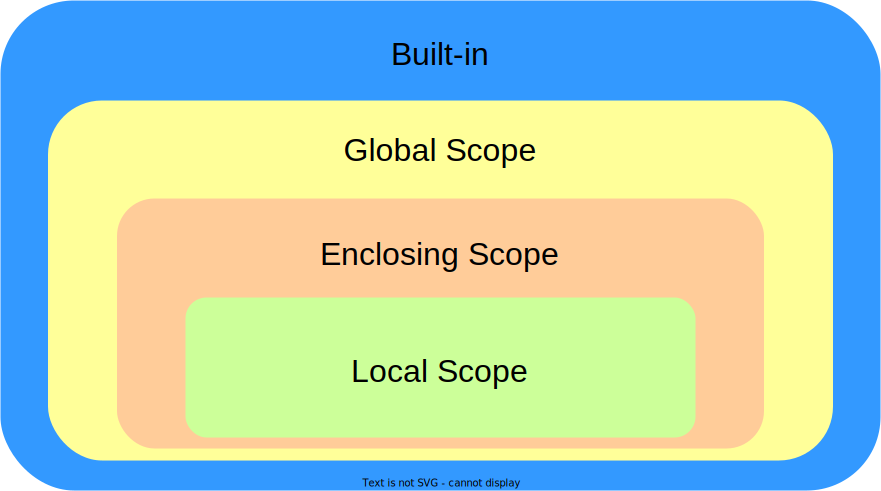

# 변수
## 변수의 범위(Scope)

* 내장 범위(Built-in Scope): 파이썬에서 기본적으로 제공하는 범위
* 전역 범위(Global Scope): 전체 코드에서 접근 가능한 모듈별 범위
* 비지역 범위(Enclosing Scope): 함수와 클래스의 중첩된 범위
* 지역 범위(Local Scope): 함수나 메소드의 기능별 최소 범위

이를 두고, 흔히 **LEGB Rule**이라고 부른다.

## Built-in
* 내장 변수:
    * __debug__: 디버깅 모드 여부
    * __import__(): 모듈을 동적으로 import
    * __name__: 모듈의 이름
    * __package__: 모듈의 패키지 이름
    * __doc__: 모듈의 독스트링
    * __loader__: 모듈의 로더
    * __spec__: 모듈의 정보
    ...
* 내장 함수:
    * globals(): 전역 범위의 변수를 dict로 반환
    * locals(): 현재 범위의 변수를 dict로 반환
    * dir(): 객체의 속성을 list로 반환
    * vars(): 객체의 속성을 dict로 반환
    * ...

** 파이썬에서 제공하는 내장 변수와 내장 함수는 공식 문서에서 참조할 수 있다.**

## Global
* 전체 코드에서 접근 가능한 변수를 의미
* `global` 키워드를 사용하여 전역 변수임을 명시 가능
* 무분별한 전역 변수 사용은 코드의 가독성을 떨어뜨리고, 디버깅을 어렵게 만듦

** 전역 변수를 사용해야 하는 경우는 상수를 선언할 때

** 전역 변수를 사용하는 것보다는 객체의 속성으로 사용하는 것이 좋음

## Nonlocal
* 중첩된 함수에서 사용되는 변수를 의미
* `nonlocal` 키워드를 사용하면 상위 범위의 변수를 재정의할 수 있음
* `nonlocal` 키워드를 사용할 수 있는 범위는 함수 내부 뿐임

** `nonlocal` 키워드를 사용하는 것보다는 객체의 속성으로 사용하는 것이 좋음
** 클래스의 private, protected 속성을 활용하면 더욱 좋음

## Local
* 변수가 선언된 블록에서만 접근 가능
* 함수의 매개변수도 함수 내부에서만 접근 가능

** 함수 내부에서 `global` 키워드와 `nonlocal` 키워드를 동시에 사용할 수 없음
